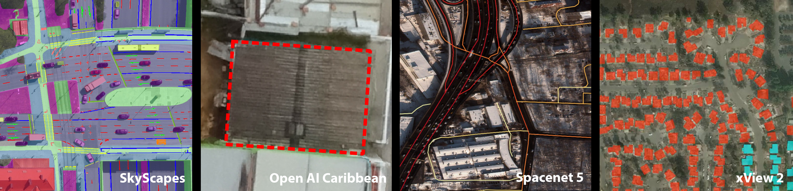

# Awesome Satellite Imagery Datasets 

List of aerial and satellite imagery datasets with annotations for computer vision and deep learning. Newest datasets at the top of each category (Instance segmentation, object detection, semantic segmentation, scene classification, other).   

  

## Recent additions and ongoing competitions

- [**NEON Tree Crowns Dataset**](https://zenodo.org/record/3765872#.YHs-MBMzbUI) *(Weinstein et al., 2020)*     
Individual tree crown objects, height&area estimates, 100 million instances, 37 geographic sites across the US, [DeepForest](https://github.com/weecology/DeepForest) Python package, Paper: [Weinstein et al. 2020](https://elifesciences.org/articles/62922)    
  
- [**IEEE Data Fusion Contest 2021**](https://www.grss-ieee.org/community/technical-committees/2021-ieee-grss-data-fusion-contest-track-dse/) *(IEEE, HP, SolarAid, Data Science Experts, Mar 2021)*   
Detection of settlements without electricity, 98 multi-temporal/multi-sensor tiles ( Sentinel-1, Sentinel-2, Landsat-8, VIIRS), per chip & per pixel labels (contains buildings, presence electricity). 
  
- [**FloodNet Challenge**](http://www.classic.grss-ieee.org/earthvision2021/challenge.html) *(UMBC, Microsoft, Texas A&M, Dewberry, May 2021)*  
2343 UAV images from after Hurricane Harvey, landcover labels (10 categories, e.g. building flooded, building non-flooded, road-flooded, ..), 2 competition tracks (Binary & semantic flood classification; Object counting & condition recognition)  
  
- [**Dynamic EarthNet Challenge**](http://www.classic.grss-ieee.org/earthvision2021/challenge.html) *(Planet, DLR, TUM, April 2021)*  
Weekly Planetscope time-series (3m res.) over 2 years, 75 aois, landcover labels (7 categories), 2 competition tracks (Binary land cover classification & multi-class change detection)
  
  

## 1. Instance Segmentation

- [**SpaceNet 7: Multi-Temporal Urban Development Challenge**](https://spacenet.ai/sn7-challenge/) *(CosmiQ Works, Planet, Aug 2020)*   
Monthly building footprints and Planet imagery (4m. res) timeseries for 2 years, 100 locations around the globe, for building footprint evolution & address propagation. 

- [**RarePlanes: Synthetic Data Takes Flight**](https://aireverie.com/rareplanes) *(CosmiQ Works, A.I.Reverie, June 2020)*   
Synthetic (630k planes, 50k images) and real (14.7k planes, 253 Worldview-3 images (0.3m res.), 122 locations, 22 countries) plane annotations & properties and satellite images. [Tools](https://github.com/aireveries/RarePlanes). Paper: [Shermeyer et al. 2020](https://arxiv.org/abs/2006.02963)

- [**SpaceNet: Multi-Sensor All-Weather Mapping**](https://spacenet.ai/sn6-challenge/) *(CosmiQ Works, Capella Space, Maxar, AWS, Intel, Feb 2020)*   
48k building footprints (enhanced 3DBAG dataset, building height attributes), Capella Space SAR data (0.5m res., four polarizations) & Worldview-3 imagery (0.3m res.), Rotterdam, Netherlands.

- [**Agriculture-Vision Database & CVPR 2020 challenge**](https://www.agriculture-vision.com/agriculture-vision-2020/dataset) *(UIUC,
Intelinair, CVPR, Jan 2020)*   
Agricultural Pattern Analysis, 21k aerial farmland images (RGB-NIR, USA, 2019 season, 512x512px chips), label masks for 6 field anomaly patterns (Cloud shadow, Double plant, Planter skip, Standing Water, Waterway and Weed cluster). Paper: [Chiu et al. 2020](https://arxiv.org/abs/2001.01306)  

- [**iSAID: Large-scale Dataset for Object Detection in Aerial Images**](https://captain-whu.github.io/iSAID/dataset.html) *(IIAI & Wuhan University, Dec 2019)*  
15 categories from plane to bridge, 188k instances, object instances and segmentation masks (MS COCO format), Google Earth & JL-1 image chips, Faster-RCNN baseline model (MXNet), [devkit](https://github.com/CAPTAIN-WHU/iSAID_Devkit), Academic use only, replaces [DOTA dataset](https://captain-whu.github.io/DOTA/), Paper: [Zamir et al. 2019](https://arxiv.org/abs/1905.12886)   

- [**xView 2 Building Damage Asessment Challenge**](https://xview2.org) *(DIUx, Nov 2019)* .   
550k building footprints & 4 damage scale categories, 20 global locations and 7 disaster types (wildfire, landslides, dam collapses, volcanic eruptions, earthquakes/tsunamis, wind, flooding), Worldview-3 imagery (0.3m res.), pre-trained baseline model. Paper: [Gupta et al. 2019](http://openaccess.thecvf.com/content_CVPRW_2019/html/cv4gc/Gupta_Creating_xBD_A_Dataset_for_Assessing_Building_Damage_from_Satellite_CVPRW_2019_paper.html)   

- **Microsoft BuildingFootprints** [**Canada**](https://github.com/Microsoft/CanadianBuildingFootprints) **&** [**USA**](
https://github.com/microsoft/USBuildingFootprints) **&** [**Uganda/Tanzania**](
https://github.com/microsoft/Uganda-Tanzania-Building-Footprints) **&** [Australia](https://github.com/microsoft/AustraliaBuildingFootprints) *(Microsoft, Mar 2019)*   
12.6mil (Canada) & 125.2mil (USA) & 17.9mil (Uganda/Tanzania) & 11.3mil (Australia) building footprints, GeoJSON format, delineation based on Bing imagery using ResNet34 architecture.    

- [**SpaceNet 4: Off-Nadir Buildings**](
https://spacenet.ai/off-nadir-building-detection/) *(CosmiQ Works, DigitalGlobe, Radiant Solutions, AWS, Dec 2018)*   
126k building footprints (Atlanta), 27 WorldView 2 images (0.3m res.) from 7-54 degrees off-nadir angle. Bi-cubicly resampled to same number of pixels in each image to counter courser native resolution with higher off-nadir angles, Paper: [Weir et al. 2019](https://arxiv.org/abs/1903.12239)   

- [**Airbus Ship Detection Challenge**](https://www.kaggle.com/c/airbus-ship-detection) *(Airbus, Nov 2018)*   
131k ships, 104k train / 88k test image chips, satellite imagery (1.5m res.), raster mask labels in in run-length encoding format, Kaggle kernels.   

- [**Open AI Challenge: Tanzania**](https://competitions.codalab.org/competitions/20100#learn_the_details-overview) *(WeRobotics & Wordlbank, Nov 2018)*   
Building footprints & 3 building conditions, RGB UAV imagery - [Link to data](https://docs.google.com/spreadsheets/d/1kHZo2KA0-VtCCcC5tL4N0SpyoxnvH7mLbybZIHZGTfE/edit#gid=0)   

- [**Netherlands LPIS agricultural field boundaries**](https://www.pdok.nl/introductie/-/article/basisregistratie-gewaspercelen-brp-) *(Netherlands Department for Economic Affairs)*   
294 crop/vegetation catgeories, 780k parcels, yearly dataset for 2009-2018.

- [**Denmark LPIS agricultural field boundaries**](https://kortdata.fvm.dk/download/Markblokke_Marker?page=MarkerHistoriske) *(Denmark Department for Agriculture)*   
293 crop/vegetation catgeories, 600k parcels, yearly dataset for 2008-2018   

- [**CrowdAI Mapping Challenge**](https://www.crowdai.org/challenges/mapping-challenge) *(Humanity & Inclusion NGO, May 2018)*  
Buildings footprints, RGB satellite imagery, COCO data format   

- [**SpaceNet 2: Building Detection v2**](https://spacenet.ai/spacenet-buildings-dataset-v2/) *(CosmiQ Works, Radiant Solutions, NVIDIA, May 2017)*  
685k building footprints, 3/8band Worldview-3 imagery (0.3m res.), 5 cities, SpaceNet Challenge Asset Library   

- [**SpaceNet 1: Building Detection v1**](https://spacenet.ai/spacenet-buildings-dataset-v1/) *(CosmiQ Works, Radiant Solutions, NVIDIA, Jan 2017)*  
Building footprints (Rio de Janeiro), 3/8band Worldview-3 imagery (0.5m res.), SpaceNet Challenge Asset Library   

## 2. Object Detection

- [**NEON Tree Crowns Dataset**](https://zenodo.org/record/3765872#.YHs-MBMzbUI) *(Weinstein et al., 2020)*     
Individual tree crown objects, height&area estimates, 100 million instances, 37 geographic sites across the US, [DeepForest](https://github.com/weecology/DeepForest) Python package, Paper: [Weinstein et al. 2020](https://elifesciences.org/articles/62922)    
    
- [**xView 2018 Detection Challenge**](http://xviewdataset.org) *(DIUx, Jul 2018)*   
60 categories from helicopter to stadium, 1 million instances, Worldview-3 imagery (0.3m res.), COCO data format, pre-trained Tensorflow and Pytorch baseline models, Paper: [Lam et al. 2018](https://arxiv.org/abs/1802.07856)   

- [**Open AI Challenge: Aerial Imagery of South Pacific Islands**](https://docs.google.com/document/d/16kKik2clGutKejU8uqZevNY6JALf4aVk2ELxLeR-msQ/edit) *(WeRobotics & Worldbank, May 2018)*  
Tree position & 4 tree species, RGB UAV imagery (0.4m/0.8m res.), multiple AOIs in Tonga   

- [**NIST DSE Plant Identification with NEON Remote Sensing Data**](https://www.ecodse.org) *(inria.fr, Oct 2017)*  
Tree position, tree species and crown parameters, hyperspectral (1m res.) & RGB imagery (0.25m res.), LiDAR point cloud and canopy height model   

- [**NOAA Fisheries Steller Sea Lion Population Count**](https://www.kaggle.com/c/noaa-fisheries-steller-sea-lion-population-count) *(NOAA, Jun 2017)*  
5 sea lion categories, ~ 80k instances, ~ 1k aerial images, Kaggle kernels   

- [**Stanford Drone Data**](http://cvgl.stanford.edu/projects/uav_data/?source=post_page---------------------------) *(Stanford University, Oct 2016)*   
60 aerial UAV videos over Stanford campus and bounding boxes, 6 classes (Pedestrian, Biker, Skateboarder, Cart, Car, Bus), Paper: [Robicquet et al. 2016](https://infoscience.epfl.ch/record/230262/files/ECCV16social.pdf;)    

- [**Cars Overhead With Context (COWC)**](https://gdo152.llnl.gov/cowc/) *(Lawrence Livermore National Laboratory, Sep 2016)*   
32k car bounding boxes, aerial imagery (0.15m res.), 6 cities, Paper: [Mundhenk et al. 2016](https://arxiv.org/abs/1609.04453)    

## 3. Semantic Segmentation

- [**FloodNet Challenge**](http://www.classic.grss-ieee.org/earthvision2021/challenge.html) *(UMBC, Microsoft, Texas A&M, Dewberry, May 2021)*  
2343 UAV images from after Hurricane Harvey, landcover labels (10 categories, e.g. building flooded, building non-flooded, road-flooded, ..), 2 competition tracks (Binary & semantic flood classification; Object counting & condition recognition)  
  
- [**Dynamic EarthNet Challenge**](http://www.classic.grss-ieee.org/earthvision2021/challenge.html) *(Planet, DLR, TUM, April 2021)*  
Weekly Planetscope time-series (3m res.) over 2 years, 75 aois, landcover labels (7 categories), 2 competition tracks (Binary land cover classification & multi-class change detection)  

- [**Sentinel-2 Cloud Mask Catalogue**](https://zenodo.org/record/4172871) *(Francis, A., et al., Nov 2020)*
513 cropped subscenes (1022x1022 pixels) taken randomly from entire 2018 Sentinel-2 archive. All bands resampled to 20m, stored as numpy arrays. Includes clear, cloud and cloud-shadow classes. Also comes with binary classification tags for each subscene, describing what surface types, cloud types, etc. are present.

- [**LandCoverNet: A Global Land Cover Classification Training Dataset**](https://doi.org/10.34911/rdnt.d2ce8i) *(Alemohammad S.H., et al., Jul 2020)*
Version 1.0 of the dataset that contains data across Africa, (20% of the global dataset). 1980 image chips of 256 x 256 pixels in V1.0 spanning 66 tiles of Sentinel-2. Classes: water, natural bare ground, artificial bare ground, woody vegetation, cultivated vegetation, (semi) natural vegetation, and permanent snow/ice. Citation: [Alemohammad S.H., et al., 2020](https://doi.org/10.34911/rdnt.d2ce8i) and [blog post](https://medium.com/radiant-earth-insights/radiant-earth-foundation-releases-the-benchmark-training-data-landcovernet-for-africa-7e8906e846a3)

- [**LandCover.ai: Dataset for Automatic Mapping of Buildings, Woodlands and Water from Aerial Imagery**](http://landcover.ai/) *(Boguszewski, A., et al., May 2020)*
41 orthophotos (9000x9000 px) over Poland, Aerial Imagery (25cm & 50cm res.), manual segmentations masks for Buildings, Woodland and Water, Paper: [Boguszewski et al., 2020](https://arxiv.org/abs/2005.02264)

- [**95-Cloud: A Cloud Segmentation Dataset**](https://github.com/SorourMo/95-Cloud-An-Extension-to-38-Cloud-Dataset) *(S. Mohajerani et. all, Jan 2020)*  
34701 manually segmented 384x384 patches with cloud masks, Landsat 8 imagery (R,G,B,NIR; 30 m res.), Paper: [Mohajerani et al. 2021](https://ieeexplore.ieee.org/document/9394710)

- [**Open Cities AI Challenge**](https://www.drivendata.org/competitions/60/building-segmentation-disaster-resilience/page/150/) *(GFDRR, Mar 2020)* .   
790k building footprints from Openstreetmap (2 label quality categories), aerial imagery (0.03-0.2m resolution, RGB, 11k 1024x1024 chips, COG format), 10 cities in Africa.

- [**DroneDeploy Segmentation Dataset**](https://github.com/dronedeploy/dd-ml-segmentation-benchmark) *(DroneDeploy, Dec 2019)*   
Drone imagery (0.1m res., RGB), labels (7 land cover catageories: building, clutter, vegetation, water, ground, car) & elevation data, baseline model implementation.

- [**SkyScapes: Urban infrastructure & lane markings**](https://www.dlr.de/eoc/en/desktopdefault.aspx/tabid-12760/22294_read-58694/) *(DLR, Nov 2019)*   
Highly accurate street lane markings (12 categories e.g. dash line, long line, zebra zone) & urban infrastructure (19 categories e.g. buildings, roads, vegetation). Aerial imagery (0.13 m res.) for 5.7 km2 of Munich, Germany. Paper: [Azimi et al. 2019](http://openaccess.thecvf.com/content_ICCV_2019/papers/Azimi_SkyScapes__Fine-Grained_Semantic_Understanding_of_Aerial_Scenes_ICCV_2019_paper.pdf)

- [**Open AI Challenge: Caribbean**](https://www.drivendata.org/competitions/58/disaster-response-roof-type/page/143/) *(MathWorks, WeRobotics, Wordlbank, DrivenData, Dec 2019)*   
Predict building roof type (5 categories, e.g. concrete, metal etc.) of provided building footprints (22,553), RGB UAV imagery (4cm res., 7 areas in 3 Carribbean countries)

- [**SpaceNet 5: Automated Road Network Extraction & Route Travel Time Estimation**](https://spacenet.ai/sn5-challenge/) *(CosmiQ Works, Maxar, Intel, AWS, Sep 2019)*  
2300 image chips, street geometries with location, shape and estimated travel time, 3/8band Worldview-3 imagery (0.3m res.), 4 global cities, 1 holdout city for leaderboard evaluation, [APLS](https://github.com/CosmiQ/apls) metric, [baseline model](https://github.com/CosmiQ/cresi)    

- [**SEN12MS**](https://mediatum.ub.tum.de/1474000) *(TUM, Jun 2019)*  
180,748 corresponding image triplets containing Sentinel-1 (VV&VH), Sentinel-2 (all bands, cloud-free), and MODIS-derived land cover maps (IGBP, LCCS, 17 classes, 500m res.). All data upsampled to 10m res., georeferenced, covering all continents and meterological seasons, Paper: [Schmitt et al. 2018](https://arxiv.org/abs/1906.07789)  

- [**Slovenia Land Cover Classification**](http://eo-learn.sentinel-hub.com) *(Sinergise, Feb 2019)*  
10 land cover classes, temporal stack of hyperspectral Sentinel-2 imagery (R,G,B,NIR,SWIR1,SWIR2; 10 m res.) for year 2017 with cloud masks, Official Slovenian land use land cover layer as ground truth.  

- [**ALCD Reference Cloud Masks**](https://zenodo.org/record/1460961#.XYCTRzYzaHt) *(CNES, Oct 2018)*  
8 classes (inc. cloud and cloud shadow) for 38 Sentinel-2 scenes (10 m res.).
Manual labeling & active learning, Paper: [Baetens et al. 2019](https://www.mdpi.com/2072-4292/11/4/433)

- [**Agricultural Crop Cover Classification Challenge**](https://crowdanalytix.com/contests/agricultural-crop-cover-classification-challenge) *(CrowdANALYTIX, Jul 2018)*   
2 main categories corn and soybeans, Landsat 8 imagery (30m res.), USDA Cropland Data Layer as ground truth.

- [**SpaceNet 3: Road Network Detection**](https://spacenet.ai/spacenet-roads-dataset/) *(CosmiQ Works, Radiant Solutions, Feb 2018)*   
8000 km of roads in 5 city aois, 3/8band Worldview-3 imagery (0.3m res.), SpaceNet Challenge Asset Library, Paper: [Van Etten et al. 2018](https://arxiv.org/abs/1807.01232)   

- [**Urban 3D Challenge**](https://spacenet.ai/the-ussocom-urban-3d-competition/) *(USSOCOM, Dec 2017)*    
157k building footprint masks, RGB orthophotos (0.5m res.), DSM/DTM, 3 cities, SpaceNet Challenge Asset Library   

- [**DSTL Satellite Imagery Feature Detection Challenge**](https://www.kaggle.com/c/dstl-satellite-imagery-feature-detection) *(Dstl, Feb 2017)*  
10 land cover categories from crops to vehicle small, 57 1x1km images, 3/16-band Worldview 3 imagery (0.3m-7.5m res.), Kaggle kernels   

- [**SPARCS: S2 Cloud Validation data**](https://www.usgs.gov/land-resources/nli/landsat/spatial-procedures-automated-removal-cloud-and-shadow-sparcs-validation) *(USGS, 2016)*   
7 categories (cloud, cloud shadows, cloud shadows over water, water etc.), 80 1kx1k px. subset Landsat 8 scenes (30m res.), Paper: [Hughes, J.M. & Hayes D.J. 2014](https://www.mdpi.com/2072-4292/6/6/4907)

- [**Biome: L8 Cloud Cover Validation data**](https://landsat.usgs.gov/landsat-8-cloud-cover-assessment-validation-data) *(USGS, 2016)*  
4 cloud categories (cloud, thin cloud, cloud shadows, clear), 96 Landsat 8 scenes (30m res.), 12 biomes with 8 scenes each, Paper: [Foga et al. 2017](https://www.sciencedirect.com/science/article/pii/S0034425717301293?via%3Dihub)

- [**Inria Aerial Image Labeling**](https://project.inria.fr/aerialimagelabeling/contest/) *(inria.fr)*  
Building footprint masks, RGB aerial imagery (0.3m res.), 5 cities   

- [**ISPRS Potsdam 2D Semantic Labeling Contest**](http://www2.isprs.org/commissions/comm3/wg4/2d-sem-label-potsdam.html) *(ISPRS)*   
6 urban land cover classes, raster mask labels, 4-band RGB-IR aerial imagery (0.05m res.) & DSM, 38 image patches   

## 4. Scene classification (chip/Image recognition)

- [**BigEarthNet: Large-Scale Sentinel-2 Benchmark**](http://bigearth.net) *(TU Berlin, Jan 2019)*  
Multiple landcover labels per chip based on CORINE Land Cover (CLC) 2018, 590,326 chips from Sentinel-2 L2A scenes (125 Sentinel-2 tiles from 10 European countries, 2017/2018), 66 GB archive, Paper: [Sumbul et al. 2019](https://arxiv.org/abs/1902.06148)   

- [**WiDS Datathon 2019 : Detection of Oil Palm Plantations**](https://www.kaggle.com/c/widsdatathon2019) *(Global WiDS Team & West Big Data Innovation Hub, **Jan 2019**)*
Prediction of presence of oil palm plantations, Planet satellite imagery (3m res.)., ca. 20k 256 x 256 pixel chips, 2 categories oil-palm and other, annotator confidence score.   

- [**So2Sat LCZ42**](https://mediatum.ub.tum.de/1454690) *(TUM Munich & DLR, Aug 2018)*   
Local climate zone classification, 17 categories (10 urban e.g. compact high-rise, 7 rural e.g. scattered trees), 400k 32x32 pixel chips covering 42 cities (LCZ42 dataset), Sentinel 1 & Sentinel 2 (both 10m res.), 51 GB   

- [**Cactus Aerial Photos**](https://www.kaggle.com/irvingvasquez/cactus-aerial-photos) *(CONACYT Mexico, Jun 2018)*  
17k aerial photos, 13k cactus, 4k non-actus, Kaggle kernels, Paper: [López-Jiménez et al. 2019](https://www.sciencedirect.com/science/article/pii/S1574954119300895?via%3Dihub)

- [**Statoil/C-CORE Iceberg Classifier Challenge**](https://www.kaggle.com/c/statoil-iceberg-classifier-challenge) *(Statoil/C-CORE, Jan 2018)*  
2 categories ship and iceberg, 2-band HH/HV polarization SAR imagery, Kaggle kernels   

- [**Functional Map of the World Challenge**](https://www.iarpa.gov/challenges/fmow.html) *(IARPA, Dec 2017)*  
63 categories from solar farms to shopping malls, 1 million chips, 4/8 band satellite imagery (0.3m res.), COCO data format, baseline models, Paper: [Christie et al. 2017](https://arxiv.org/abs/1711.07846)

- [**EuroSAT**](http://madm.dfki.de/downloads) *(DFK, Aug 2017)*  
10 land cover categories from industrial to permanent crop, 27k 64x64 pixel chips, 3/16 band Sentinel-2 satellite imagery (10m res.), covering cities in 30 countries, Paper: [Helber et al. 2017](https://arxiv.org/abs/1709.00029)   

- [**Planet: Understanding the Amazon from Space**](https://www.kaggle.com/c/planet-understanding-the-amazon-from-space) *(Planet, Jul 2017)*  
13 land cover categories + 4 cloud condition categories, 4-band (RGB-NIR) satelitte imagery (5m res.), Amazonian rainforest, Kaggle kernels    

- [**RESISC45**](https://www.tensorflow.org/datasets/catalog/resisc45) *(Northwestern Polytechnical University NWPU, Mar 2017)*  
45 scene categories from airplane to wetland, 31,500 images (700 per category, 256x256 px), image chips taken from Google Earth (rich image variations in resolution, angle, geography all over the world), [Download Link](https://onedrive.live.com/?authkey=%21AHHNaHIlzp%5FIXjs&cid=5C5E061130630A68&id=5C5E061130630A68%21107&parId=5C5E061130630A68%21112&action=locate), Paper: [Cheng et al. 2017](https://arxiv.org/abs/1703.00121)   

- [**Deepsat: SAT-4/SAT-6 airborne datasets**](https://csc.lsu.edu/~saikat/deepsat/) *(Louisiana State University, 2015)*   
6 land cover categories, 400k 28x28 pixel chips, 4-band RGBNIR aerial imagery (1m res.) extracted from the 2009 National Agriculture Imagery Program (NAIP), Paper: [Basu et al. 2015](https://arxiv.org/abs/1509.03602)     

- [**UC Merced Land Use Dataset**](http://weegee.vision.ucmerced.edu/datasets/landuse.html) *(UC Merced, Oct 2010)*   
21 land cover categories from agricultural to parkinglot, 100 chips per class, aerial imagery (0.30m res.), Paper: [Yang & Newsam 2010](https://www.researchgate.net/publication/221589425_Bag-of-visual-words_and_spatial_extensions_for_land-use_classification)   

## 5. Other Focus / Multiple Tasks

- [**IEEE Data Fusion Contest 2021**](https://www.grss-ieee.org/community/technical-committees/2021-ieee-grss-data-fusion-contest-track-dse/) *(IEEE, HP, SolarAid, Data Science Experts, Mar 2021)*   
Detection of settlements without electricity, 98 multi-temporal/multi-sensor tiles ( Sentinel-1, Sentinel-2, Landsat-8, VIIRS), per chip & per pixel labels (contains buildings, presence electricity). 
  
- [**IEEE Data Fusion Contest 2020**](https://ieee-dataport.org/competitions/2020-ieee-grss-data-fusion-contest) *(IEEE & TUM, Mar 2020)*  
Land cover classification based on SEN12MS dataset (see category Semantic Segmentation on this list), low- and high-resolution tracks.

- [**IEEE Data Fusion Contest 2019**](https://ieee-dataport.org/open-access/data-fusion-contest-2019-dfc2019) *(IEEE, Mar 2019)*  
Multiple tracks: Semantic 3D reconstruction, Semantic Stereo, 3D-Point Cloud Classification. Worldview-3 (8-band, 0.35cm res.) satellite imagery, LiDAR (0.80m pulse spacing, ASCII format), semantic labels, urban setting USA, baseline methods provided, Paper: [Le Saux et al. 2019](https://ieeexplore.ieee.org/document/8672157)   

- [**IEEE Data Fusion Contest 2018**](https://ieee-dataport.org/open-access/2018-ieee-grss-data-fusion-challenge-%E2%80%93-fusion-multispectral-lidar-and-hyperspectral-data) *(IEEE, Mar 2018)*  
20 land cover categories by fusing three data sources: Multispectral LiDAR, Hyperspectral (1m), RGB imagery (0.05m res.)  

- [**DEEPGLOBE - 2018 Satellite Challange**](http://deepglobe.org/index.html) *(CVPR, Apr 2018)*  
Three challenge tracks: Road Extraction, Building Detection, Land cover classification, Paper: [Demir et al. 2018](https://arxiv.org/abs/1805.06561)  

- [**TiSeLaC : Time Series Land Cover Classification Challenge**](https://sites.google.com/site/dinoienco/tiselc) *(UMR TETIS, Jul 2017)*  
Land cover time series classification (9 categories), Landsat-8 (23 images time series, 10 band features, 30m res.), Reunion island   

- [**Multi-View Stereo 3D Mapping Challenge**](https://www.iarpa.gov/challenges/3dchallenge.html) *(IARPA, Nov 2016)*  
Develop a Multi-View Stereo (MVS) 3D mapping algorithm that can convert high-resolution Worldview-3 satellite images to 3D point clouds, 0.2m lidar ground truth data.   

- [**Draper Satellite Image Chronology**](https://www.kaggle.com/c/draper-satellite-image-chronology) *(Draper, Jun 2016)*  
Predict the chronological order of images taken at the same locations over 5 days, Kaggle kernels

## More Resources

- [**awesome-remote-sensing-change-detection**](https://github.com/wenhwu/awesome-remote-sensing-change-detection)  
- [**Radiant MLHub Training Data Registry**](http://registry.mlhub.earth/)  
